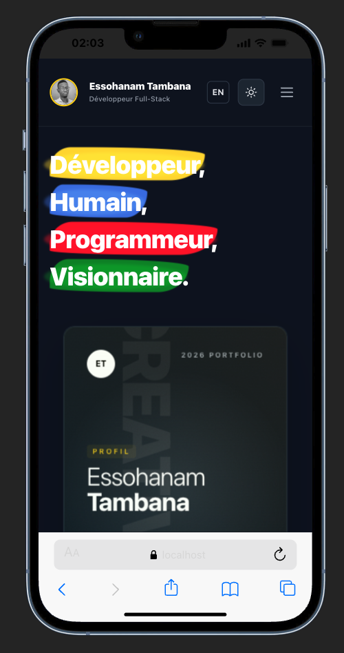

<a name="readme-top"></a>

<div align="center">
  
  <br/>
  <h3><b>Phil Dev - Portfolio</b></h3>
</div>

# 📗 Table of Contents

- [📖 About the Project](#about-project)
  - [🛠 Built With](#built-with)
    - [Tech Stack](#tech-stack)
    - [Key Features](#key-features)
  - [🚀 Live Demo](#live-demo)
- [💻 Getting Started](#getting-started)
  - [Prerequisites](#prerequisites)
  - [Setup](#setup)
  - [Install](#install)
  - [Usage](#usage)
  - [Run tests](#run-tests)
  - [Deployment](#deployment)
- [👥 Authors](#authors)
- [🔭 Future Features](#future-features)
- [🤝 Contributing](#contributing)
- [⭐️ Show your support](#support)
- [🙏 Acknowledgements](#acknowledgements)
- [📝 License](#license)

# 📖 Phil Dev Portfolio <a name="about-project"></a>

**Phil Dev** is a state-of-the-art, hyper-interactive developer portfolio designed to showcase professional growth and technical expertise with a premium aesthetic. Built with Next.js 14, it features high-end animations, seamless multi-language support, and a unique holographic user identification system.

## 🛠 Built With <a name="built-with"></a>

### Tech Stack <a name="tech-stack"></a>

<details>
  <summary>Client</summary>
  <ul>
    <li><a href="https://nextjs.org/">Next.js 14</a></li>
    <li><a href="https://react.dev/">React.js</a></li>
    <li><a href="https://tailwindcss.com/">Tailwind CSS</a></li>
    <li><a href="https://www.typescriptlang.org/">TypeScript</a></li>
  </ul>
</details>

<details>
  <summary>Animations & Visuals</summary>
  <ul>
    <li><a href="https://www.framer.com/motion/">Framer Motion</a></li>
    <li><a href="https://gsap.com/">GSAP</a></li>
    <li><a href="https://lucide.dev/">Lucide React</a></li>
  </ul>
</details>

<details>
<summary>Services</summary>
  <ul>
    <li><a href="https://resend.com/">Resend (Email API)</a></li>
    <li><a href="https://vercel.com/">Vercel (Deployment)</a></li>
  </ul>
</details>

### Key Features <a name="key-features"></a>

- **Holographic Interactive Ticket**: A visually stunning 3D ticket ID that responds to mouse movement and displays user credentials.
- **Dynamic Experience Timeline**: A clean, animated vertical timeline that tracks professional milestones with precise mobile-to-desktop alignment.
- **Full Multi-language (i18n)**: One-click toggle between French and English across the entire application.
- **Glassmorphism & Dark Mode**: A premium UI design system using sleek transparency effects and smooth theme transitions.

<p align="right">(<a href="#readme-top">back to top</a>)</p>

## 🚀 Live Demo <a name="live-demo"></a>

- [Live Demo Link](https://phil-dev-ghostessos-projects.vercel.app)

<p align="right">(<a href="#readme-top">back to top</a>)</p>

## 💻 Getting Started <a name="getting-started"></a>

To get a local copy up and running, follow these steps.

### Prerequisites

You need to have Node.js and npm installed on your machine.

### Setup

Clone this repository to your desired folder:

```sh
  git clone https://github.com/GhostEsso/phil_dev.git
```

### Install

Install dependencies:

```sh
  cd phil_dev
  npm install
```

### Usage

To run the development server:

```sh
  npm run dev
```

### Run tests

To run the linter:

```sh
  npm run lint
```

### Deployment

This project is optimized for deployment on Vercel. Connect your GitHub repository to Vercel for automatic deployments.

<p align="right">(<a href="#readme-top">back to top</a>)</p>

## 👥 Authors <a name="authors"></a>

👤 **Essohanam Tambana**

- GitHub: [@GhostEsso](https://github.com/GhostEsso)
- Twitter: [@TambanaEssohana](https://x.com/TambanaEssohana)
- LinkedIn: [Essohanam Tambana](https://www.linkedin.com/in/essohanam-tambana/)

<p align="right">(<a href="#readme-top">back to top</a>)</p>

## 🔭 Future Features <a name="future-features"></a>

- [ ] **Blog Section**: Integration of a blog to share technical articles.
- [ ] **Project Case Studies**: Detailed breakdowns for each major project.
- [ ] **3D Portfolio Background**: Implementation of Three.js for a more immersive experience.

<p align="right">(<a href="#readme-top">back to top</a>)</p>

## 🤝 Contributing <a name="contributing"></a>

Contributions, issues, and feature requests are welcome!

Feel free to check the [issues page](https://github.com/GhostEsso/phil_dev/issues).

<p align="right">(<a href="#readme-top">back to top</a>)</p>

## ⭐️ Show your support <a name="support"></a>

If you like this project, please consider giving it a ⭐!

<p align="right">(<a href="#readme-top">back to top</a>)</p>

## 🙏 Acknowledgments <a name="acknowledgements"></a>

- Thanks to the Next.js and Vercel communities for the amazing tooling.
- Inspiration from modern design systems and premium portfolio architectures.

<p align="right">(<a href="#readme-top">back to top</a>)</p>

## 📝 License <a name="license"></a>

This project is [MIT](./LICENSE) licensed.

<p align="right">(<a href="#readme-top">back to top</a>)</p>
